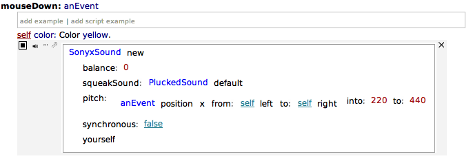
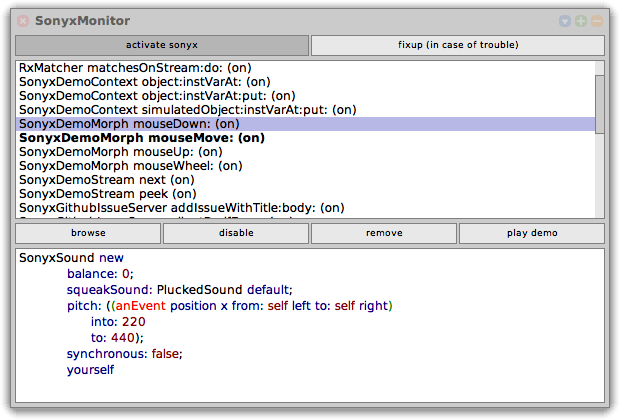

# sonyx

[](https://github.com/LinqLover/sonyx/actions/workflows/test.yml)
[](https://coveralls.io/github/LinqLover/sonyx?branch=prototyping)
[](https://github.com/LinqLover/sonyx/actions/workflows/release.yml)

**sonyx** (***S***ound-based t***O***ols for u***N***derstanding of software s***Y***stems through e***X***ploration) is a toolkit for exploring software systems through sonification in [Squeak/Smalltalk](https://squeak.org).
It has initially been developed within the course ["Sonic Thinking - Methods of Working with Sound"](https://hpi.de/studium/im-studium/lehrveranstaltungen/it-systems-engineering-ma/lehrveranstaltung/sose-21-3286-sonic-thinking-seminar-_-methods-of-working-with-sound.html) and has been evaluated and extended within the course ["Neurodesign Lecture - Designing for Empathy in Business Contexts"](https://hpi.de/studium/im-studium/lehrveranstaltungen/digital-health-ma/lehrveranstaltung/wise-21-22-3319-neurodesign-lecture-_-designing-for-empathy-in-business-contexts.html) offered by Julia von Thienen from the [neurodesign group @ HPI](https://hpi.de/neurodesign/home.html).
For more information, please refer to [theoretical background](#theoretical-background-literature--acknowledgments).

The main idea of sonyx is to empower developers to understand software systems by listening to particular interesting aspects in the source code.
To do this, developers can create *sound probes* on the fly for any expression in any method in the system.
Whenever this expression is reached during the system execution, a user-defined sound is played.
Developers can customize and combine these sounds or even configure them to dynamically reflect the state or result of the expression.

This project is based on [Babylonian Programming/Smalltalk](https://github.com/hpi-swa-lab/babylonian-programming-smalltalk/) and [Sandblocks](https://github.com/hpi-swa/sandblocks).

## Impressions

*Make sure to turn your sound on!*
<video src="https://user-images.githubusercontent.com/38782922/131224109-b474991a-5558-4a62-aff4-ed17e512e663.mp4"></video>

<table>
<tbody>
<tr>
<td><a href="./assets/probe.png"></img></a></td>
<td><a href="./assets/monitor.png"></img></a></td>
</tr>
</tbody>
</table>

<small>[Browse all screenshots and screencasts](./assets)</small>

## Download and installation

A ready-to-use Squeak image is available in the [latest release](https://github.com/LinqLover/sonyx/releases).
Extract the zip file and execute the `squeak.bat` file on Windows, the `squeak.sh` on Linux, or run the app bundle on macOS.

If you wish, you can also set up sonyx yourself:

1. Install the latest Trunk updates for [Squeak](https://squeak.org).

2. Open a workspace and evaluate the following:
   ```smalltalk
   Metacello new
   	baseline: 'Sonyx';
   	repository: 'github://LinqLover/sonyx:master';
   	load.
   ```

## Usage

### About Squeak

If you are new to Squeak/Smalltalk, I recommend you learn a few basics about it before exploring this project.
Squeak is a programming environment that is quite different from many other contemporary solutions.
Some aspects of its main philosophy are that everything is an object, including the environment, the compiler, and even all tools in the system, as well as that the user can always interact with or modify all of these objects.
As a consequence, you will need to have a basic knowledge of the Squeak tools in order to understand this project or to browse its implementation.

The book **[Squeak by Example](https://github.com/hpi-swa-lab/SqueakByExample-english#readme)** provides a pretty good introduction to Squeak (for this project, you should refer to the Trunk version/`SBE-Trunk.pdf` from the latest preprint).
It is recommended that you skim through the sections in chapter 1 ("A quick tour of Squeak") but at the very least read section 1.6 ("The system browser") and section 1.7 ("Finding classes").

### Using sonyx

In the ready-to-use image (see [download and installation](#download-and-installation) above), you will find a link to the **`SonyxDemos` class.**
When browsing this class, you can select any of the demo messages, select the last line of the method comment (which is denoted by the quotes), and press <kbd>Cmd</kbd> + <kbd>d</kbd> to run this demo.
To inspect how an example works, select a class or method in its example of interest (for instance, `SonyxDemoStream` or `sorted2`) and press <kbd>Cmd</kbd> + <kbd>b</kbd> resp. <kbd>Cmd</kbd> + <kbd>m</kbd> to browse it resp. to look up its implementation.

You can **define your own sound probes** in any method you want.
For example, after opening the demo morph example, browse to `SonyxDemoMorph >> #mouseEnter:`, select an expression such as `self`, do a yellow-button click (usually, this corresponds to your right mouse button), and choose "add sonyx probe" from the menu.
Now a probe annotation is displayed that you can use to configure the sound.
Use the prehear icon to listen to it.
Whenever you now invoke this method (in this example, move your mouse over the demo morph to do that), this sound is played.
To customize the sound, type into the probe annotation or click on any part of it to change it.
For instance, click on the default squeakSound (`#horn`) to replace it with another sound (maybe `#croak`).
Afterward, press <kbd>Cmd</kbd> + <kbd>s</kbd> to save the sound probe and trigger it again.

You can **add further parameters to the sound** by selecting the entire `SonyxSound` expression with a click and pressing <kbd>Ctrl</kbd> + <kbd>i</kbd> (insert).
Click into the `msg` field to choose a parameter key (for instance, `balance:`).
In the next field, you can enter a value for this parameter (e.g., `0`).
Save the probe again and trigger the sound to listen to the difference.
Your sound can also dynamically reflect the context of the method invocation.
To do so, replace the parameter value with any Smalltalk expression that refers to the method context (e.g., `anEvent position x from: self left to: self right`).
If you now trigger the sound probe again, you can hear the difference based on the circumstances of the method invocation (e.g., at which position your mouse cursor has entered the demo morph).

To retrieve an overview of all currently playing sounds, open the **Sonyx Monitor** from the main docking bar on top of the screen in the Apps menu.
It displays a list of all sound probes that are defined in the system.
Watch it while triggering some sounds.
You can select any sound probe to read the sound definition, browse the method where the probe is defined, disable/enable the probe, remove it, or prehear the sound.

### Troubleshooting

At the current stage of this project, occasional hick-ups cannot be precluded.
In the event that you should stumble into any problems, next to contacting me an option is to check the following guide:

- To stop all running sounds, press <kbd>Cmd</kbd> + <kbd>dot</kbd>.
- If the sound monitor highlights no longer playing sounds, try the fixup options from the "fixup (in case of trouble)" button on the top.
- If you cannot hear any sounds, try to stop all runnings sounds first.
  If this does not help, open the sonyx monitor, press the fixup button, and choose "Forget all errors".
- If any other terrible things have happened that stop you from using sonyx as expected, just close Squeak without saving the changes and try your luck again.

In any case, if you find any defect that you are able to reproduce, I will appreciate your bug report.

## Architecture

The package structure of this project is organized as follows:

<table>
	<thead>
		<tr>
			<td><strong>Package</strong></td>
			<td><strong>Description</strong></td>
		</tr>
	</thead>
	<tbody>
		<tr>
			<td><a href="packages/BaselineOfSonyx.package/">BaselineOfSonyx</a></td>
			<td>Package metadata.
			Contains scripts to set up the deploy image and fill it with an initial welcome text.</td>
		</tr>
		<tr>
			<td><a href="packages/Sonyx-Core.package/">Sonyx-Core</a></td>
			<td>Contains core functionality of sonyx and integration into the Squeak system.
			Provides the sound API and a set of sound samples.</td>
		</tr>
		<tr>
			<td><a href="packages/Sonyx-Demo.package/">Sonyx-Demo</a></td>
			<td>Contains several examples that demonstrate the features of sonyx.
			Browse <code>SonyxDemos</code> to see an overview of all of them.</td>
		</tr>
		<tr>
			<td><a href="packages/Sonyx-Tests.package/">Sonyx-Tests</a></td>
			<td>End-to-end tests for sonyx.</td>
		</tr>
		<tr>
			<td><a href="packages/Sonyx-UI.package/">Sonyx-UI</a></td>
			<td>View logic for the facilities implemented in the Core package. Includes sound annotations, a sound monitor, and integrates Sandblocks into the probe annotations.</td>
		</tr>
		<tr>
			<td><a href="packages/Sonyx-Study-Base.package/">Sonyx-Study-Base</a></td>
			<td>Framework for running the <a href="#user-study">user study</a>.</td>
		</tr>
		<tr>
			<td><a href="packages/Sonyx-Study-RVV.package/">Sonyx-Study-RVV</a></td>
			<td>LED visualizations for a visual control condition in the study, based on <a href="https://github.com/hpi-swa-teaching/live21-value-visualization">Runtime Value Visualizations</a>.</td>
		</tr>
		<tr>
			<td><a href="packages/Sonyx-Study-Solutions.package/">Sonyx-Study-Solutions</a></td>
			<td>Model solutions to the programming tasks for the user study.</td>
		</tr>
		<tr>
			<td><a href="packages/Sonyx-StudyTasks.package/">Sonyx-StudyTasks</a></td>
			<td>Materials for the programming tasks for the user study.</td>
		</tr>
	</tbody>
</table>

## User Study

We have conducted a controlled experiment with 6 partipants to quantitatively evaluate the use of auditory display in exploratory programming.
All details on the design and the outcomes of the study are described [here](./docs/study).

## Theoretical background, literature & acknowledgments

There is so much more to tell about this project!
For all the other details, including important related work and underlying goals of sonyx, please refer to the [wiki](https://github.com/LinqLover/sonyx/wiki/Material#project-slides-for-the-sonic-thinking-seminar).
There are also [acknowledgments](./ACKNOWLEDGMENTS.md) to many kind people.
Special thanks go to Julia von Thienen for the statistical evaluation of the user study as well as Tom Beckmann ([@tom95](https://github.com/tom95)) and Patrick Rein ([@codeZeilen](https://github.com/codeZeilen)) for their unremitting support and close cooperation to get sonyx integrated into Babylonian and Sandblocks!

Please also refer to [UPSTREAM.md](./UPSTREAM.md) for a list of further implementational work that has been done in the context of this project.

## Outlook & known limitations

This is only a prototype, and there are still plenty of other ideas that have not yet been tried out.
You can find a selection of small and big ideas in the [project board](https://github.com/LinqLover/sonyx/projects/1).

Some known technical limitations to date are:

- Limited mouse controls of probe expressions. While intended to be completely configurable as GUI, nested sounds and additional parameters still require keyboard control at the moment.
- No compatibility with vanilla Babylonian - inserting examples in a method will play unexpected sounds.

Please do not hesitate to create an issue if you have further ideas or troubles!
