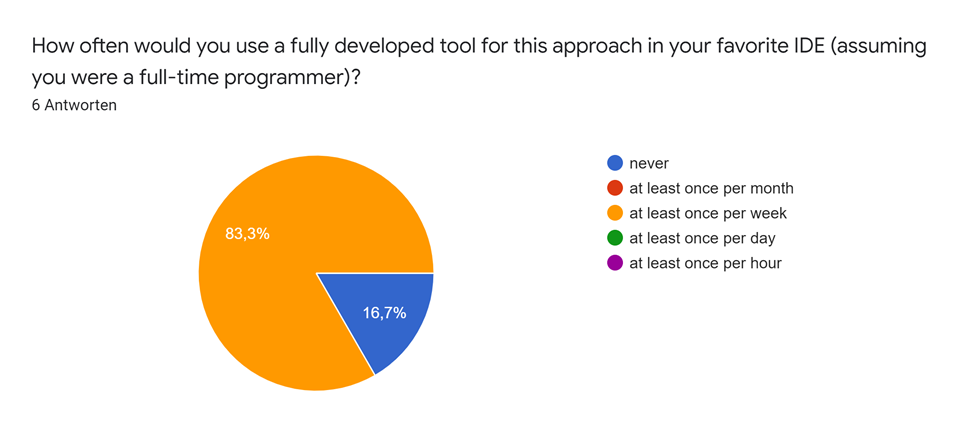

# Sonyx User Study Evaluation

Overview: [Design](./study-design.md) · **Evaluation**

---

## Quantitative Evaluation

### Experimental data

Distribution of measuring data (extract) per condition (rows), measures (columns), and tasks (colors):

All raw data are available to the authors and will be provided by request in a pseudonymized form.

### Testing of statistical hypotheses

All statistical tests have been performed using IBM SPSS.

#### Programming experience/cognitive empathy

> **Null hypothesis:** The expected value for the tooling satisfaction [solution confidence, subjective efficiency, cognitive empathy] of programmers in the experimental condition does not significantly deviate from the expected value for programmers in the control conditions.
>
> **Alternative hypothesis:** The expected value for the \<measure\> of programmers in the experimental condition significantly deviates from the expected value for programmers in the control conditions.

Falsified via ANOVA test, thus the alternative hypothesis is confirmed.

- tooling satisfaction/„fun“:

  - A marginal shift in the fun scores can be seen for participants in the exp. cond. as opposed to the null condition, but it is not strong in effect size ($\Delta \approx +0.66$) nor in probability ($p_1 = 11.8\%$).

    

        
Analysis

        </img>
        </img>
        </img>
        </img>
    

- solution confidence:

  - tbd

- subjective efficiency:

  - The distribution of efficiency scores partitioned by the exp. cond. vs null cond. does not follow a clear pattern. No significant influence of the tooling on the subjective efficiency could be shown.

- cognitive empathy:

  - The choice of the condition (experimental vs. null) influences the empathy score with $p_2 = 5.8\%$ and the effect size ($\Delta \approx +1.00$) is very large (according to Cohen‘s $d$; point estimate: $-0.998$). As the influence is almost statistically significant and the effect size is clear, we consider the hypothesis as proven.

    

        
Analysis

        </img>
        </img>
        </img>
        </img>
    

#### Programming efficiency

> Is the expected value for the success score of programmers in the experimental condition higher than the expected value for programmers in the null condition?

The data suggest a clear shift towards a better success score when the sonyx prototype is used instead of the base tooling. The only task that could not be solved with the help of sonyx was the sorting task (presumably because it requires a perfect pitch for comparing similar tones representing close numbers during the sorting). The choice of the condition (experimental vs. null) influences the success score with $p_1 = 7.9\%$ and the mean score in the exp. cond. is more than 2 points higher than in the null condition.

> Is the expected value for the time to success of programmers in the experimental condition higher than the expected value for programmers in the null condition?

In the experiment, more than 75% of all tasks were not solved in a significantly shorted timespan than the maximum time of 30 min. We assume this is the case because most tasks were phrased rather open-ended. No significant influence of the tooling on the time to success could be shown.

#### Sonic Affinity

> **Null hypothesis:** Within the experimental group, the expected values for the efficiency, comprehension, and experience (conflated into a single score) of programmers do not show any significant correlation to their sonic affinity.
>
> **Alternative hypothesis:** These expected values do show a significant correlation to the programmers‘ sonic affinity.

The statistical analysis suggests a positive correlation between the sonic affinity of participants and their efficiency/comprehension/experience scores for tasks solved within the experimental group. The hypothesis is confirmed.

#### RVV control condition

> Do they above hypotheses apply to the comparison of RVV vs. null condition?

There is no statistical significance indicating that the measures for the programming experience neither for the cognitive empathy of participants in the exp. cond. would outperform the RVV cond. However, the opposite seems to be the case, which is even statistically significant for the subjective efficiency which is 1 point higher by average in the RVV cond. as opposed to the exp. cond., suggesting a causality with $p_2 = 7.6\%$.

As for the efficiency, the mean success score in the exp. cond. slightly outperforms the RVV cond., but this correlation is not statistically significant. However, when excluding the sorting task for the argument from above, it can be seen that all remaining task assignments yielded to a higher success when the participants where provided with the sonyx prototype.

### Answer to the causal hypotheses

- > **Hypothesis 1:** Proficient Squeak/Smalltalk programmers solve programming tasks more effectively when using the *sonyx* prototype (compared to using the tooling of the base system only).

  As visible for the success score measure, this causality holds true for the sample of participants with a strong effect size and $p_1 = 7.9\%$ but only for some task types.

- > **Hypothesis 2:** Proficient Squeak/Smalltalk programmers are more satisfied with their process when using the *sonyx* prototype to solve programming tasks (compared to using the tooling of the base system only).

  Overall, there was no statistically significant observation for this hypothesis. Only the tooling satisfaction was marginally higher in the exp. cond.

- > **Hypothesis 3:** Proficient Squeak/Smalltalk programmers succeed better in developing cognitive empathy with a software system that are trying to analyze within a programming tasks when using the *sonyx* prototype (compared to using the tooling of the base system only).

  As described above, this hypothesis holds true for the sample of participants with $p_2 = 5.8\%$.

### Limitations and threats to validity

#### Threats to validity

- systematic
  - predefined solution strategies (no autonomous tool choice)
  - artificial tasks (not necessarily representative for real workloads)
  - heterogenous task set (limited cross-comparability)
  - possible interviewer/experimenter bias
  - smaller necessary improvisation during a few sessions
  - Confidence: Participants were given an informal oral feedback on their own solution before filling in the questionnaire for the assignment.
- quantities
  - small number of participants ($N = 6$)

#### Limitations

- Only considered a single step of a typical programming activity.
- not tested: creativity of finding approach for problem solving

## Qualitative Evaluation

### Observations

- frequently used features: earcons, audicons, prehear, disable probe
- rarely used features: sonyx monitor
- wide spectrum of sounds chosen: some preferred as decent tones as possible, others extravagant tones
- common misexpectations to the UI:
  - assumption: probe is saved automatically
  - cannot insert probe without reference expression
  - not all squeakSounds can be customized for the pitch
    - ideas: add visual indication for earcons vs audicons, smarten completion suggestions?
  - all sounds turned off after playing ill-configured probe
    - solution: increase robustness (done)

### Questionnaire

- prototype – convenience:

  - majority found prototype convenient
  - most inconveniences: system browser integration
  - highest satisfaction: configuration interface

- prototype – learning curve:

  - 4 out of 6 participants reported easy learnability

    

- approach – 5 out of 6 participants would use a fully developed tool at least once per week in their normal workday

  

### Oral feedback

#### Approach – strengths & weaknesses

**Strengths:**

- understand runtimes/performance/amounts
- alternative to logging: perceive many data points, count invocations
- interactive monitoring: distinguish many events, understand active code parts/branches
- alternative to limited output bandwidth of visual devices:
  - not enough screen space
  - debugging a roboter (visual display is moving away)

**Weaknesses:**

- distinguishing similar tones requires perfect pitch
- approach does not scale for larger datasets
  - idea: aggregations ([#8](https://github.com/LinqLover/sonyx/issues/8))?
- cannot memorize longer sequences
  - idea: recording/replaying tool, interactive sound navigation?
- sometimes, sounds are experienced as overwhelming/annoying

#### Prototype – I like, I wish

**I like …**

- editing convenience: templates/completion suggestions
- sound monitor
- enablement checkbox for probes

**I wish …**

- clearer communication of execution order for probes
- probes without reference expression
  - upstream issue (Babylonian)
- full configuration interface in sonyx monitor
- global volume control
- better range control of values for sonification
  - ideas: detect range automatically? provide default frequency range?
- feature request: mapping of integers to identifying audicons
- more intuitive sound control (unknown/hard Sandblocks editor)
  - upstream issue?
  - improve mouse support?
- feature request: provide result from selected expression in probe